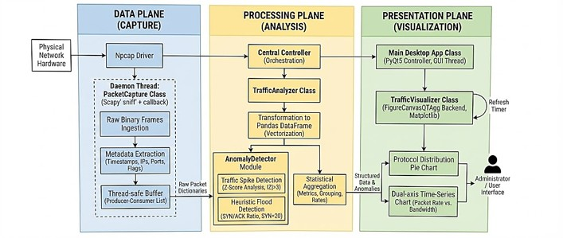

# Npcap-network-monitor
A lightweight, host-based network traffic monitoring system using Npcap and Python. Features real-time packet capture, Z-Score anomaly detection, and PyQt5 visualization.

# Lightweight Npcap-Based Network Traffic Monitor


## 📌 Project Overview
A lightweight, host-based network traffic monitoring system designed to bridge the complexity-visibility gap in traditional network tools. Built specifically for modern Windows environments using the **Npcap** driver, this system provides real-time packet capture, deep packet inspection (DPI), and automated anomaly detection without the overwhelming cognitive load of raw hex dumps or the high costs of closed-source enterprise suites.

This project was developed to provide a transparent, "glass-box" analytical tool tailored for educational and research environments, focusing on L2-L4 protocol analysis and real-time security auditing.

Project Structure
```bash
Network-Traffic-Monitor/
│
├── data/                   # For storing captured JSON data
├── docs/                   # For storing documentation and images (architecture diagrams, flowcharts)
│   ├── architecture.jpg
│   ├── flowchart.jpg
│   └── ui_screenshot.jpg
│
├── analyzer.py             # Data analysis and transformation module
├── desktop_app.py          # Main programme and PyQt5 GUI
├── detector.py             # Z-Score and SYN Flood anomaly detection logic
├── packet_capture.py       # Npcap/Scapy multi-threaded packet capture core
├── visualizer.py           # Matplotlib real-time visualisation module
│
├── requirements.txt        # List of dependency packages
├── .gitignore              # Files to be excluded from uploads (e.g. cache, packet capture data)
└── README.md               # Core documentation for the project

```

## ✨ Key Features
* **Multi-threaded Capture Engine:** Decouples data acquisition from the GUI using a producer-consumer model, ensuring high-throughput capture without freezing the interface.
* **Kernel-Level Visibility:** Utilizes the Npcap driver (NDIS 6 API) to intercept Ethernet, IP, TCP, UDP, and ICMP frames, including local loopback traffic.
* **Automated Anomaly Detection:**
  * **Traffic Spike Detection:** Implements statistical **Z-Score analysis** ($|Z| > 3$) to identify volumetric anomalies and bandwidth spikes in real-time.
  * **SYN Flood Heuristics:** Monitors SYN/ACK flag ratios to proactively detect "half-open" connection attacks and port scans.
* **Dynamic Data Visualization:** Transforms raw binary frames into structured Pandas DataFrames, rendering real-time protocol distribution pie charts and dual-axis throughput time-series graphs via PyQt5 and Matplotlib.

## 🏗️ System Architecture
The application is strictly designed using a Modular Design Pattern, separated into three distinct logical planes:
1. **Data Plane (Capture):** Reliable ingestion of binary frames via `PacketCapture` (Scapy sniff + Npcap).
2. **Processing Plane (Analysis):** Data structuring, vectorization via Pandas, and security heuristic execution via the `AnomalyDetector`.
3. **Presentation Plane (Visualization):** The interactive PyQt5 dashboard managed by `TrafficVisualizer`.



## 🚀 Installation & Setup

### Prerequisites
1. **Operating System:** Windows 10 / 11
2. **Npcap Driver:** Must be installed on your system. [Download Npcap here](https://npcap.com/). (Ensure "Install Npcap in WinPcap API-compatible Mode" is checked if required by other tools, though this uses native Npcap).
3. **Python:** Version 3.8 or higher.

### Quick Start
1. Clone the repository:
   ```bash
   git clone [https://github.com/yourusername/Network-Traffic-Monitor.git](https://github.com/yourusername/Network-Traffic-Monitor.git)
   cd Network-Traffic-Monitor
Install the required dependencies:

Bash
pip install -r requirements.txt
Run the application (Administrator privileges may be required for promiscuous mode capture):

Bash
python desktop_app.py


###📊 Dashboard Previews


###Capture Tab: Real-time packet parsing and metadata extraction.


###Analysis Tab: Protocol distribution and Top Talker metrics.


###Detection Tab: Z-Score and SYN Flood alert logs.


🛡️ Scope & Limitations
Supported Protocols: Deep header scanning for Ethernet (L2), IP (L3), and TCP/UDP/ICMP (L4).

Encryption: Payload decryption for SSL/TLS (HTTPS) is out of scope. Analysis on encrypted traffic relies strictly on flow metadata (IPs, ports, volume).

Deployment: Designed as a host-based edge-node analyzer, not a distributed sensor network.

👨‍💻 Author
Tan Minjun

Bachelor of Information Technology (Honours) Communications and Networking, UTAR.
